<div align="center">

### 🏢 شرکت فولاد نورد آتیه


---

### 💻 پروژه Ironclad POS
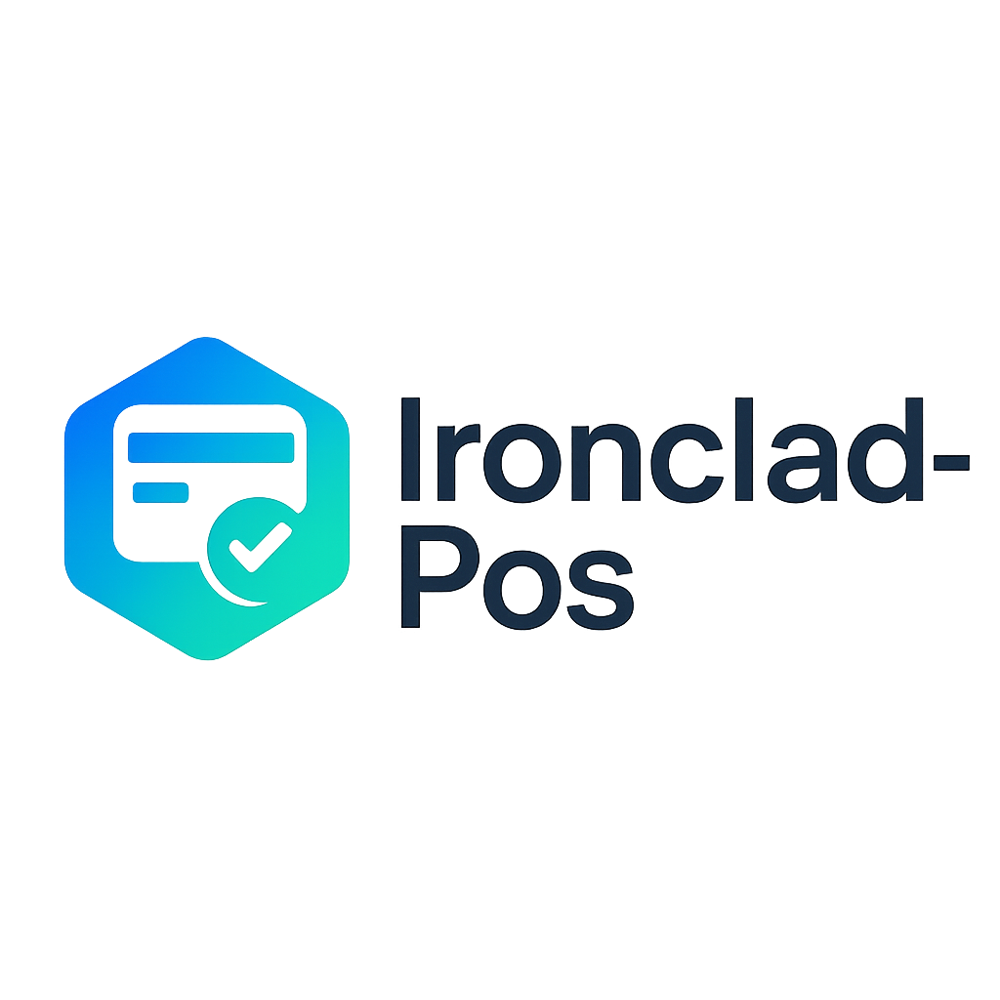

---

<h1>سامانه داخلی مدیریت فروش (Ironclad POS)</h1>

<a href="./readme.md">
  
</a>

</div>

---

## 🛒 Ironclad POS چیست؟
**Ironclad POS** یک **سامانه داخلی مدیریت فروش (In-House POS)** مبتنی بر Django است که برای مشتریان شرکت **فولاد نورد آتیه** توسعه داده شده.  
این سامانه به سازمان‌ها امکان می‌دهد عملیات فروش و مدیریت موجودی خود را به‌صورت یکپارچه و کارآمد انجام دهند.  

🔗 این سیستم روی سرور یا دستگاه محلی نصب می‌شود و سایر دستگاه‌ها می‌توانند از طریق **شبکه داخلی** به آن دسترسی داشته باشند.

---

<div align="center">

⚠️ **توجه مهم**  
این پروژه نسخه‌ی نهایی سامانه نیست. نسخه‌های نهایی نزد شرکت فولاد نورد آتیه محفوظ بوده و امکان انتشار عمومی آن‌ها وجود ندارد.  
نسخه‌ی حاضر صرفاً با مجوز انتشار محدود در گیت‌هاب قرار گرفته است.

</div>

---
## 📌 معرفی پروژه

**Ironclad POS** یک سامانه داخلی مدیریت فروش است که با استفاده از **Django** توسعه داده شده.  
این سیستم به شرکت‌ها و سازمان‌ها کمک می‌کند تا فرآیندهای فروش، مدیریت موجودی کالا، و ارتباط با سخت‌افزارهای فروشگاهی (مثل پرینتر رسید و نمایشگر مشتری) را به‌صورت یکپارچه و کارآمد مدیریت کنند.  

### 🎯 اهداف اصلی
- مدیریت موجودی و محصولات
- پردازش تراکنش‌های فروش
- صدور رسید با پرینترهای فروشگاهی (ESCPOS)
- پشتیبانی از نمایشگر مشتری (Customer Display)
- دسترسی چندکاربره در شبکه داخلی

### 📡 نحوه اجرا
- نصب بر روی سرور یا سیستم محلی
- اتصال سایر دستگاه‌ها (مثل تبلت یا صندوق فروشگاهی) از طریق **IP داخلی**
- تمرکز اصلی سیستم بر روی **کارایی و دقت عملیاتی** است، نه ارائه یک وب‌سایت فروشگاهی عمومی

---
## 🏢 درباره شرکت فولاد نورد آتیه

شرکت **فولاد نورد آتیه** فعالیت خود را در سال ۱۳۷۲ با تأسیس شرکت تعاونی اکتیو صنعت در شهر دامغان و با تولید ابزارآلات کشاورزی آغاز کرد.  
تأمین مواد اولیه محصولات این شرکت که عمدتاً فولاد و آهن‌آلات بود، زمینه‌ساز ارتباط گسترده با فعالان صنعت فولاد گردید و مسیر ورود شرکت به حوزه‌های جدید صنعتی را فراهم ساخت.  

در ادامه، مدیریت شرکت با تکیه بر این تجربه و ارتباطات، فعالیت‌های خود را در صنعت فولاد گسترش داد و امروز فولاد نورد آتیه به‌عنوان یکی از مجموعه‌های فعال در این حوزه شناخته می‌شود.  

### 👨‍💻 نقش در پروژه
این سامانه به‌عنوان یک پروژه داخلی در شرکت فولاد نورد آتیه توسعه داده شد.  
بنده در این پروژه مسئولیت **توسعه بخش Back-End** را برعهده داشتم.

---
## 📑 فهرست مطالب

1. [معرفی پروژه](#-معرفی-پروژه)
2. [درباره شرکت فولاد نورد آتیه](#-درباره-شرکت-فولاد-نورد-آتیه)
3. [فهرست مطالب](#-فهرست-مطالب)
4. [پیش‌نیازها](#-پیش‌نیازها)
5. [نصب و راه‌اندازی سریع](#-نصب-و-راهاندازی-سریع)
6. [پیکربندی](#-پیکربندی)
7. [راه‌اندازی اولیه](#-راهاندازی-اولیه)
8. [نحوه استفاده](#-نحوه-استفاده)
9. [Docker](#-docker)
10. [تصاویر](#-تصاویر)
11. [امکانات](#-امکانات)
12. [لایسنس](#-لایسنس)
13. [سوییچ زبان](#-english-version)

---

## ⚙️ پیش‌نیازها

برای اجرای این سامانه لازم است ابزارهای زیر را روی سیستم خود داشته باشید:

- **Python 3.9+**  
  برای اجرای پروژه و مدیریت وابستگی‌ها.

- **Docker (اختیاری)**  
  برای راه‌اندازی سریع‌تر و بدون نیاز به نصب وابستگی‌ها.

- **پایگاه داده**  
  - به صورت پیش‌فرض: SQLite  
  - همچنین پشتیبانی از **PostgreSQL** و **MySQL** در تنظیمات فراهم شده است.

---
## 🚀 نصب و راه‌اندازی سریع

### 📥 دریافت پروژه

#### روش ۱: کلون کردن ریپو
```bash
git clone https://github.com/PeakPy/IroncladPOS.git
cd IroncladPOS
pip install -r requirements.txt
````

#### روش ۲: دانلود به صورت Zip

* فایل پروژه را به صورت ZIP دانلود و استخراج کنید.

```bash
cd IroncladPOS
pip install -r requirements.txt
```

---

### 📂 ساختار کلی پروژه

* **cart/** → مدیریت سبد خرید و تراکنش‌ها
* **inventory/** → مدیریت موجودی و محصولات
* **transaction/** → مدیریت عملیات فروش و رسیدها
* **onlineretailpos/** → تنظیمات اصلی، فایل‌های استاتیک و قالب‌ها
* **images4display/** → تصاویر تبلیغاتی برای نمایشگر مشتری
* **screenshots/** → اسکرین‌شات‌ها و لوگوهای پروژه/شرکت
* **manage.py** → فایل اصلی اجرای دستورات Django
* **dockerfile** → تعریف ایمیج داکر
* **docker-compose.yml** → پیکربندی سرویس‌ها در داکر
* **requirements.txt** → وابستگی‌های پایتون
* **.env.sample** → نمونه فایل متغیرهای محیطی
* **LICENSE** → لایسنس پروژه

---
## ⚙️ پیکربندی

### 📄 فایل `.env`
- در ریشه پروژه یک فایل `.env` بسازید.  
- از فایل نمونه `.env.sample` کمک بگیرید.  
- مقادیر زیر باید در `.env` تنظیم شوند:

#### تنظیمات کلی
```env
# انتخاب محیط: devlopement | production
SETTINGS = "ironcladpos.settings.devlopement"

# کلیدهای امنیتی
SECRET_KEY_DEV = "django_dev_secret_key"
SECRET_KEY_PROD = "django_prod_secret_key"
````

#### اطلاعات فروشگاه

```env
# مشخصات فروشگاه روی رسید
RECEIPT_CHAR_COUNT = 32
STORE_NAME = "STORE NAME"
STORE_ADDRESS = "STORE ADDRESS"
STORE_PHONE = ""
Include_Phone_In_Heading = "False"

# متن‌های اضافی رسید
RECEIPT_ADDITIONAL_HEADING = ""
RECEIPT_FOOTER = "Thank You"
```

#### تنظیمات پرینتر

```env
PRINTER_VENDOR_ID = "Vendor_ID"
PRINTER_PRODUCT_ID = "Product_ID"
PRINT_RECEIPT = False
CASH_DRAWER = False
```

#### تنظیمات پایگاه داده

```env
# نوع دیتابیس (sqlite / postgres / mysql)
NAME_OF_DATABASE = "sqlite"

DB_NAME = "IroncladPOS"
DB_USERNAME = "DB_USER_NAME"
DB_PASSWORD = "DB_USER_PASS"
DB_HOST = "YOUR_DB_HOST"
DB_PORT = "YOUR_DB_HOST_PORT"
```

#### تنظیمات SSH (اختیاری)

```env
# در صورتی که اتصال دیتابیس نیازمند SSH Tunnel باشد
SSH_HOST = ""
SSH_USERNAME = ""
SSH_PASSWORD = ""
SSH_DB_HOST = ""
```

---

### 🗄️ نکات مهم

* به‌صورت پیش‌فرض از **SQLite** استفاده می‌شود.
* برای استفاده از PostgreSQL یا MySQL مقادیر `.env` را تغییر دهید.
* در حالت Docker، می‌توانید فایل `.env` را از طریق shell به کانتینر پاس بدهید یا کپی کنید.
* در صورت استفاده از دیتابیس ابری (Cloud Database) ممکن است نیاز به فعال‌سازی SSH Tunnel داشته باشید.

---

## 🛠️ راه‌اندازی اولیه

پس از نصب وابستگی‌ها و پیکربندی فایل `.env`، مراحل زیر را اجرا کنید:

### 📂 ورود به پوشه پروژه
```bash
cd IroncladPOS
````

### 🗄️ اجرای مایگریشن پایگاه داده

```bash
python manage.py makemigrations
python manage.py migrate
```

### 👤 ساخت سوپریوزر

برای دسترسی به بخش مدیریت (Django Admin) لازم است یک کاربر اصلی بسازید:

```bash
python manage.py createsuperuser
```

* **Superuser** → مدیر اصلی سیستم، دسترسی کامل دارد.
* **Staff User** → کاربرانی که اجازه دسترسی به پنل مدیریت دارند (برای افزودن محصول و مدیریت بخش‌ها).
* **Normal User** → کاربران عادی که فقط از سیستم برای ثبت تراکنش‌های فروش استفاده می‌کنند.

✅ پس از این مراحل، سامانه آماده اجرا است.

---
## ▶️ نحوه استفاده

### 🚀 اجرای سرور توسعه
برای اجرای سامانه، دستور زیر را وارد کنید:
```bash
python manage.py runserver 0.0.0.0:8000
````

* توقف سرور: با فشردن `Ctrl + C` در همان ترمینال.

---

### 🌐 دسترسی به سامانه

* روی همان دستگاه:

  ```
  http://127.0.0.1:8000
  ```
* روی دستگاه‌های دیگر در شبکه محلی (LAN):

  ```
  http://<SERVER_IP>:8000
  ```

> ⚠️ توجه: دسترسی در شبکه محلی ممکن است نیاز به تنظیمات فایروال یا شبکه داشته باشد.

---

### 🖨️ چاپ رسید

* چاپ رسید تنها روی دستگاهی امکان‌پذیر است که پرینتر POS به آن متصل شده باشد.
* مشخصات پرینتر (Vendor ID و Product ID) باید در فایل `.env` تنظیم شود.
* در صورت پشتیبانی از **ESCPOS**، رسیدها به‌صورت خودکار چاپ خواهند شد.

---

### 🖥️ نمایشگر مشتری

* برای استفاده از **Customer Display** نیاز به اتصال دو نمایشگر وجود دارد.
* تصاویر تبلیغاتی یا اطلاع‌رسانی در پوشه `images4display/` قرار می‌گیرند.
* سیستم به‌صورت خودکار اسلایدشو از تصاویر موجود در این پوشه نمایش خواهد داد.

---
## 🐳 Docker

### 📦 اجرای مستقیم با Docker Image
یک پکیج آماده از پروژه در [GitHub Container Registry](https://github.com/PeakPy/IroncladPOS/pkgs/container/ironcladpos) موجود است.

#### دریافت ایمیج:
```bash
docker pull ghcr.io/PeakPy/ironcladpos:latest
````

#### اجرای ایمیج:

```bash
docker run ghcr.io/PeakPy/ironcladpos:latest
```

* به‌صورت پیش‌فرض با تنظیمات SQLite اجرا می‌شود.
* برای شخصی‌سازی بهتر، **فایل `.env`** را به کانتینر پاس بدهید:

```bash
docker run --env-file=/path/to/.env ghcr.io/PeakPy/ironcladpos:latest
```

یا می‌توانید متغیرها را مستقیم وارد کنید:

```bash
docker run -e "SECRET_KEY=your_key" -e "DB_NAME=your_db" ghcr.io/PeakPy/ironcladpos:latest
```

---

### ⚙️ اجرای پروژه با Docker Compose (محلی)

در صورت نیاز به اجرای پروژه همراه دیتابیس (مثل PostgreSQL)، از `docker-compose.yml` استفاده کنید.

#### ساخت ایمیج:

```bash
docker compose build
```

#### اجرای سرویس‌ها:

```bash
docker compose up
```

> ⚠️ نکته: در فایل `docker-compose.yml` حتماً مقادیر `DBUSER`, `DBPASS` و `SECRET_KEY_DEV` را قبل از اجرا تغییر دهید.

---

### 🛠️ نکات تکمیلی

* اگر در اجرای Compose به خطا خوردید، یک بار `Ctrl+C` بزنید و مجدد `docker compose up` را اجرا کنید.
* می‌توانید کد پروژه را تغییر دهید و با اجرای دوباره `docker compose build` ایمیج شخصی‌سازی‌شده بسازید.


---

## 🖼️ تصاویر
### 📸 نمونه اسکرین‌شات‌ها
<table>
  <tr>
    <td>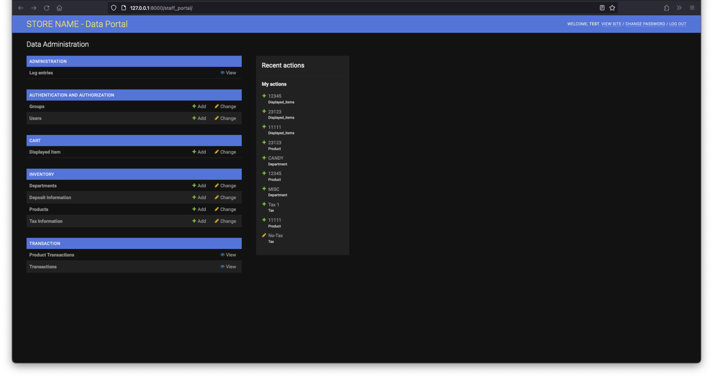</td>
    <td>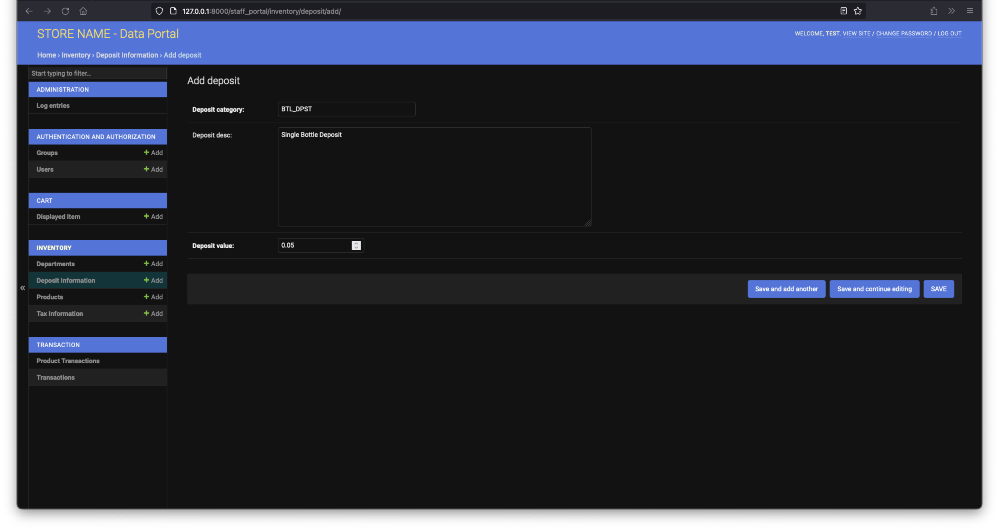</td>
  </tr>
  <tr>
    <td>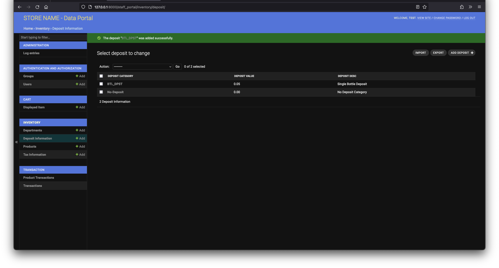</td>
    <td>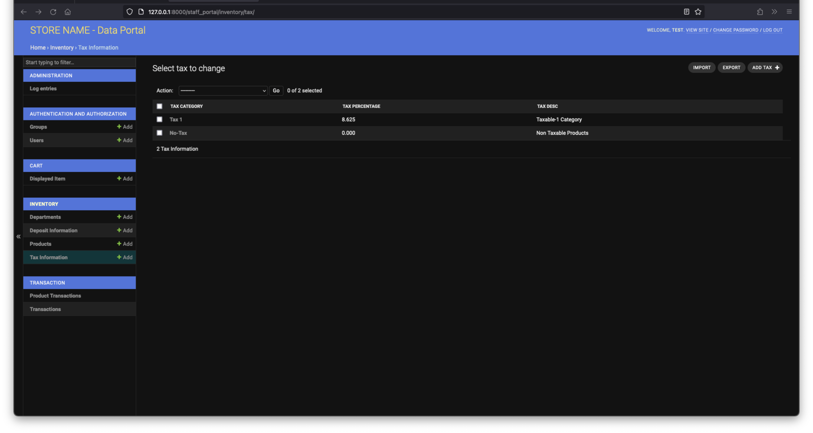</td>
  </tr>
  <tr>
    <td>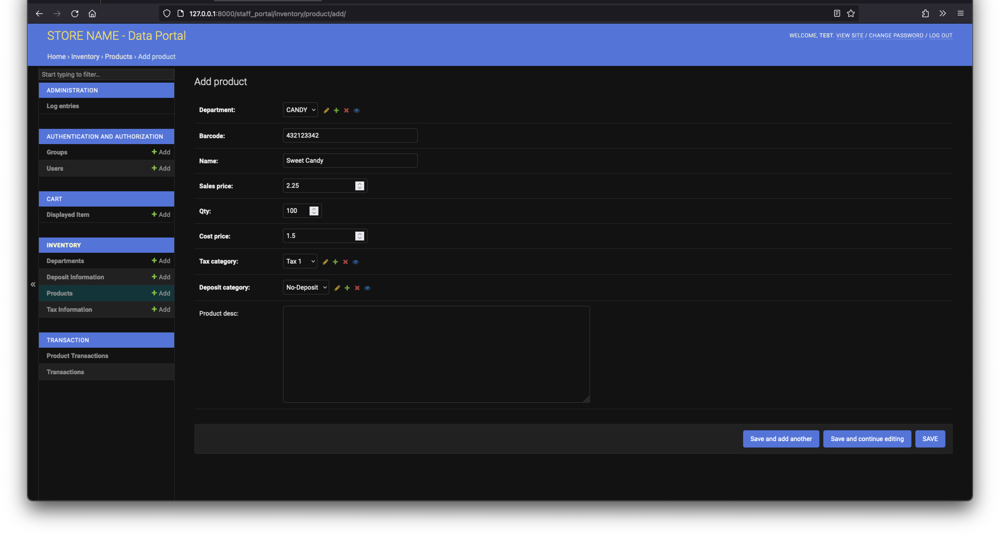</td>
    <td>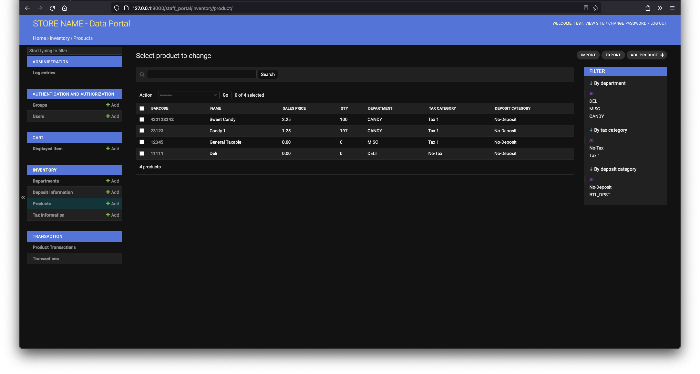</td>
  </tr>
  <tr>
    <td>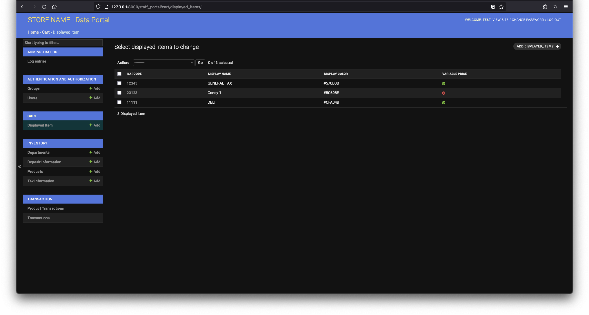</td>
    <td>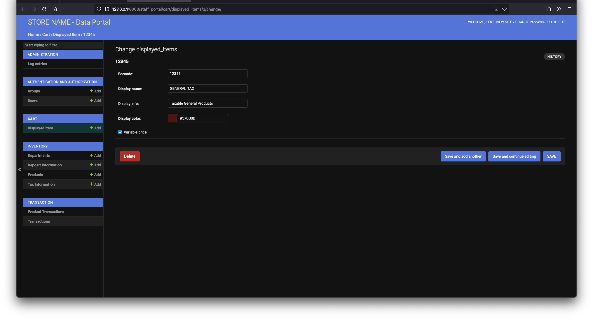</td>
  </tr>
  <tr>
    <td>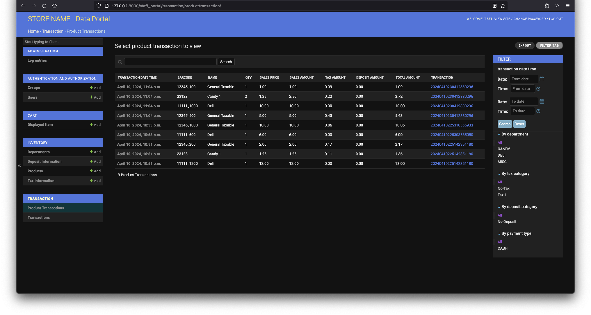</td>
    <td>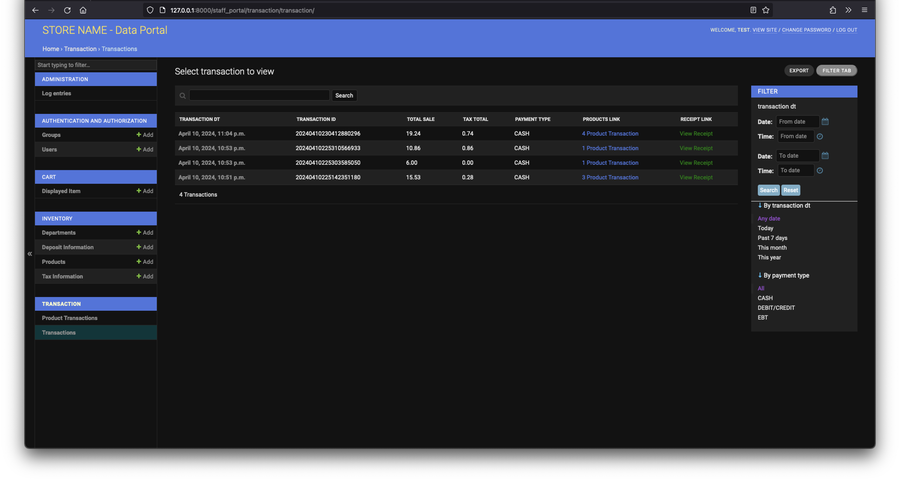</td>
  </tr>
</table>

---
## ✨ امکانات

- **مدیریت موجودی و محصولات**  
  افزودن، ویرایش و حذف کالاها با جزئیات کامل.

- **پردازش تراکنش‌های فروش**  
  ثبت خرید مشتری و مدیریت فرایند پرداخت.

- **چاپ رسید (ESCPOS)**  
  در صورت اتصال پرینتر POS به سرور یا دستگاه کاربر، امکان چاپ رسید وجود دارد.  
  (نیازمند پیکربندی Vendor ID و Product ID در فایل `.env`)

- **دسترسی چنددستگاهی در شبکه محلی**  
  استفاده همزمان از سیستم روی چند دستگاه در یک LAN با استفاده از آدرس IP.

- **نمایشگر مشتری (Customer Display)**  
  قابلیت نمایش اسلایدشو تبلیغات و اطلاعیه‌ها از پوشه `images4display/`.

- **قابلیت اجرا روی دستگاه‌های لمسی**  
  بهینه‌شده برای کاربری روی تبلت‌ها و رایانه‌های لمسی.

- **انعطاف‌پذیری در راه‌اندازی**  
  - اجرا به‌صورت محلی با Python/Django  
  - اجرا با Docker Image آماده  
  - اجرا با Docker Compose همراه پایگاه داده

---
## 📜 لایسنس

این پروژه تحت لایسنس **MIT** منتشر شده است.  
برای جزئیات بیشتر به فایل [LICENSE](LICENSE) مراجعه کنید.

---

## 🌍 تغییر زبان
این README به زبان فارسی نوشته شده است.  
برای مشاهده نسخه انگلیسی روی دکمه زیر کلیک کنید:

<a href="./readme.md">
  
</a>
