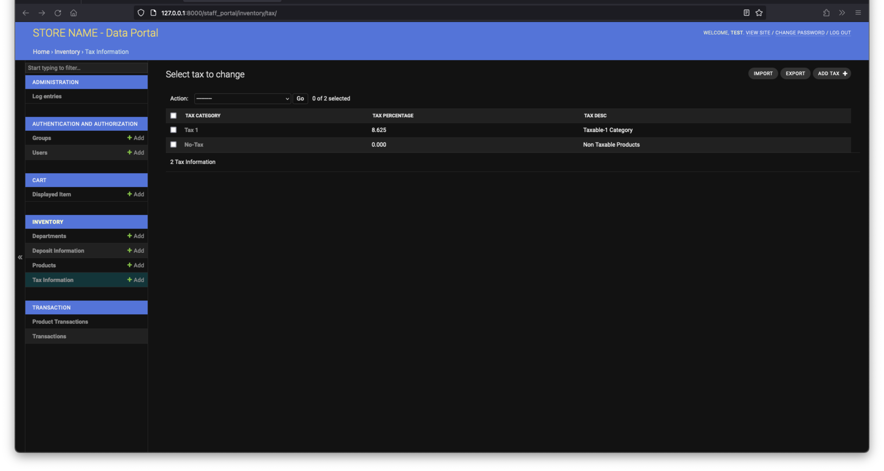
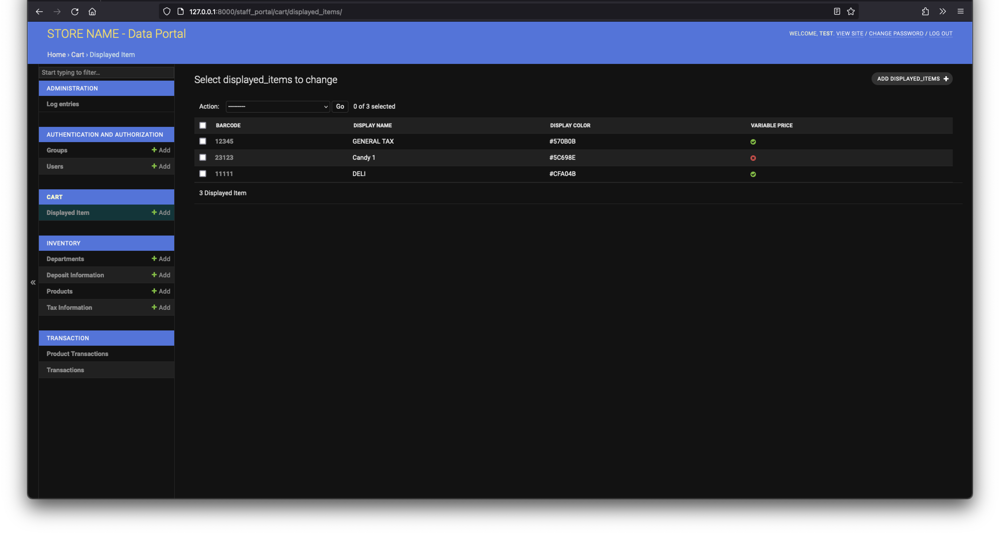
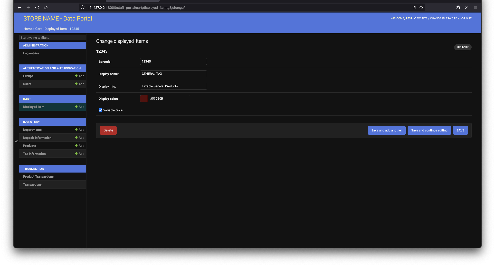
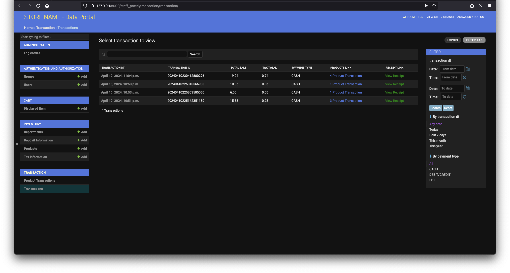

<div align="center">

<table>
  <tr>
    <td> 🢠Foolad Nourd Atieh Company</td>
    <td> 💻 Ironclad POS Project</td>
  </tr>
</table>


---

<h1>In-House Sales Management Platform (Ironclad POS)</h1>

<a href="./readme.fa.md">
  
</a>

</div>

---

## 🛒 What is Ironclad POS?
**Ironclad POS** is an **in-house Point of Sale (POS) management platform** built with Django, developed exclusively for the clients of **Foolad Nourd Atieh Company**.  
This platform enables organizations to efficiently handle their sales operations and inventory management in an integrated manner.  

🔗 The system is deployed on a local server or device, and other devices within the **internal network (LAN)** can access it.

---

<div align="center">

⚠️ **Important Notice**  
This repository does **not** contain the final production version of the system.  
The final versions are proprietary to **Foolad Nourd Atieh Company** and are not publicly available.  
This repository only contains a limited version that has been authorized for publication on GitHub.

</div>

---

## 🏢 About Foolad Nourd Atieh Company

**Foolad Nourd Atieh** began its operations in 1993 (1372 in the Persian calendar) with the establishment of *Active Sanat Cooperative Company* in Damghan, initially focusing on the production of agricultural tools.  

The company’s reliance on raw materials—primarily steel and iron products—led to extensive connections with professionals in the steel industry. These collaborations opened new opportunities and paved the way for the company’s expansion into broader industrial fields.  

Over the years, Foolad Nourd Atieh has grown into a recognized player in the Iranian steel industry, building on decades of experience, knowledge, and trusted partnerships.

---

### 👨‍💻 Role in the Project
This platform was developed as an internal project at **Foolad Nourd Atieh Company**.  
My specific responsibility in this project was **Back-End Development**.

---
## 📑 Table of Contents

1. [Project Introduction](#-what-is-ironcladpos)
2. [About Foolad Nourd Atieh Company](#-about-foolad-nourd-atieh-company)
3. [Table of Contents](#-table-of-contents)
4. [Prerequisites](#-prerequisites)
5. [Quick Start](#-quick-start)
6. [Configuration](#-configuration)
7. [Initial Setup](#-initial-setup)
8. [Usage](#-usage)
9. [Docker](#-docker)
10. [Screenshots](#-screenshots)
11. [Features](#-features)
12. [License](#-license)
13. [Language Switch](#-language-switch)

---
## ⚙️ Prerequisites

Before running the project, make sure the following tools are installed on your system:

- **Python 3.9+**  
  Required to run the Django application and manage dependencies.

- **Docker (optional)**  
  Recommended for quick setup and containerized deployment.

- **Database**  
  - Default: **SQLite**  
  - Supported: **PostgreSQL** and **MySQL** (can be configured via `.env` file)

---
## 🚀 Quick Start

### 📥 Get the Project

#### Option 1: Clone the Repository
```bash
git clone https://github.com/PeakPy/IroncladPOS.git
cd IroncladPOS
pip install -r requirements.txt
````

#### Option 2: Download as Zip

* Download the project as a ZIP file and extract it:

```bash
cd IroncladPOS
pip install -r requirements.txt
```

---

### 📂 Project Structure

* **cart/** → Shopping cart and transaction handling
* **inventory/** → Inventory and product management
* **transaction/** → Sales transactions and receipts
* **onlineretailpos/** → Core settings, static files, and templates
* **images4display/** → Images for the customer display slideshow
* **screenshots/** → Project and company logos, plus demo screenshots
* **manage.py** → Django command-line utility
* **dockerfile** → Docker image definition
* **docker-compose.yml** → Local Docker setup with services
* **requirements.txt** → Python dependencies
* **.env.sample** → Sample environment configuration
* **LICENSE** → Project license

---
## ⚙️ Configuration

### 📄 `.env` File
- Create a `.env` file in the project root.  
- Use the `.env.sample` file as a reference.  
- Below are the main environment variables:

#### General Settings
```env
# Select environment: devlopement | production
SETTINGS = "ironcladpos.settings.devlopement"

# Django secret keys
SECRET_KEY_DEV = "django_dev_secret_key"
SECRET_KEY_PROD = "django_prod_secret_key"
````

#### Store Information

```env
# Store information for receipts
RECEIPT_CHAR_COUNT = 32
STORE_NAME = "STORE NAME"
STORE_ADDRESS = "STORE ADDRESS"
STORE_PHONE = ""
Include_Phone_In_Heading = "False"

# Additional receipt content
RECEIPT_ADDITIONAL_HEADING = ""
RECEIPT_FOOTER = "Thank You"
```

#### Printer Settings

```env
PRINTER_VENDOR_ID = "Vendor_ID"
PRINTER_PRODUCT_ID = "Product_ID"
PRINT_RECEIPT = False
CASH_DRAWER = False
```

#### Database Settings

```env
# Database engine: sqlite | postgres | mysql
NAME_OF_DATABASE = "sqlite"

DB_NAME = "IroncladPOS"
DB_USERNAME = "DB_USER_NAME"
DB_PASSWORD = "DB_USER_PASS"
DB_HOST = "YOUR_DB_HOST"
DB_PORT = "YOUR_DB_HOST_PORT"
```

#### SSH Tunnel (Optional)

```env
# Only needed if your database provider requires SSH tunneling
SSH_HOST = ""
SSH_USERNAME = ""
SSH_PASSWORD = ""
SSH_DB_HOST = ""
```

---

### 🗄️ Notes

* By default, the system runs with **SQLite**.
* To use **PostgreSQL** or **MySQL**, update the `.env` file accordingly.
* In Docker setups, the `.env` file can be mounted or environment variables can be passed directly.
* If using a **cloud database**, SSH tunneling may be required depending on your provider.

---
## 🛠️ Initial Setup

After installing dependencies and configuring the `.env` file, follow these steps:

### 📂 Navigate to the project directory
```bash
cd IroncladPOS
````

### 🗄️ Apply database migrations

```bash
python manage.py makemigrations
python manage.py migrate
```

### 👤 Create a superuser

To access the Django Admin panel, create a superuser account:

```bash
python manage.py createsuperuser
```

* **Superuser** → Full access to the system (can manage everything).
* **Staff User** → Users with access to the admin panel (e.g., add products, manage departments).
* **Normal User** → Regular POS operators (can process sales but cannot modify inventory data).

✅ After completing these steps, the system is ready to run.

---
## ▶️ Usage

### 🚀 Run the development server
Start the Django server with:
```bash
python manage.py runserver 0.0.0.0:8000
````

* Stop the server with `Ctrl + C` in the terminal.

---

### 🌐 Accessing the system

* On the same machine:

  ```
  http://127.0.0.1:8000
  ```
* On other devices in the same LAN:

  ```
  http://<SERVER_IP>:8000
  ```

> ⚠️ Note: LAN access may require firewall or network adjustments.

---

### 🖨️ Receipt Printing

* Works only on the device where the POS printer is connected.
* Make sure `PRINTER_VENDOR_ID` and `PRINTER_PRODUCT_ID` are correctly set in the `.env` file.
* If the printer supports **ESCPOS**, receipts will be printed automatically.

---

### 🖥️ Customer Display

* Requires a dual-monitor setup on the device running the system.
* The folder `images4display/` contains images used for the customer-facing slideshow.
* Any images placed in this folder will be automatically included in the display rotation.

---
## 🐳 Docker

### 📦 Run with Prebuilt Docker Image
A prebuilt image of the project is available on [GitHub Container Registry](https://github.com/PeakPy/IroncladPOS/pkgs/container/ironcladpos).

#### Pull the image:
```bash
docker pull ghcr.io/PeakPy/ironcladpos:latest
````

#### Run the image:

```bash
docker run ghcr.io/PeakPy/ironcladpos:latest
```

* By default, it runs with **SQLite**.
* For better customization, pass a `.env` file to the container:

```bash
docker run --env-file=/path/to/.env ghcr.io/PeakPy/ironcladpos:latest
```

Or pass environment variables directly:

```bash
docker run -e "SECRET_KEY=your_key" -e "DB_NAME=your_db" ghcr.io/PeakPy/ironcladpos:latest
```

---

### ⚙️ Run with Docker Compose (Local)

If you want to run the system together with a database (e.g., PostgreSQL), use the provided `docker-compose.yml` file.

#### Build the image:

```bash
docker compose build
```

#### Start the services:

```bash
docker compose up
```

> ⚠️ Before running, update the values of `DBUSER`, `DBPASS`, and `SECRET_KEY_DEV` in the `docker-compose.yml` file.

---

### 🛠️ Additional Notes

* If you face errors during `docker compose up`, stop with `Ctrl + C` and run it again.
* You can customize the code and rebuild the Docker image by re-running:

```bash
docker compose build
```
---
## 🖼️ Screenshots

### 📸 Sample Screens
<table>
  <tr>
    <td></td>
    <td></td>
  </tr>
  <tr>
    <td></td>
    <td></td>
  </tr>
  <tr>
    <td></td>
    <td></td>
  </tr>
  <tr>
    <td></td>
    <td></td>
  </tr>
  <tr>
    <td></td>
    <td></td>
  </tr>
</table>

---
## ✨ Features

- **Inventory & Product Management**  
  Add, edit, and remove products with detailed information.

- **Sales Transaction Processing**  
  Record customer purchases and handle payment operations.

- **Receipt Printing (ESCPOS)**  
  If a POS printer is connected to the server or local device, receipts can be automatically printed.  
  Requires proper configuration of `PRINTER_VENDOR_ID` and `PRINTER_PRODUCT_ID` in the `.env` file.

- **Multi-device LAN Access**  
  Multiple devices on the same network can access the system using the server’s IP address.

- **Customer Display**  
  A dual-monitor setup allows a slideshow of promotional or informational images from the `images4display/` folder.

- **Touchscreen Ready**  
  Optimized for usage on tablets and touchscreen PCs.

- **Flexible Deployment Options**  
  - Run locally with Python/Django  
  - Run with a prebuilt Docker Image  
  - Run with Docker Compose alongside a database

---
## 📜 License

This project is licensed under the **MIT License**.  
For more details, please refer to the [LICENSE](LICENSE) file.

---

## 🌍 Language Switch
This README is written in English.  
To view the Persian version, click the button below:

<a href="./readme.fa.md">
  
</a>
